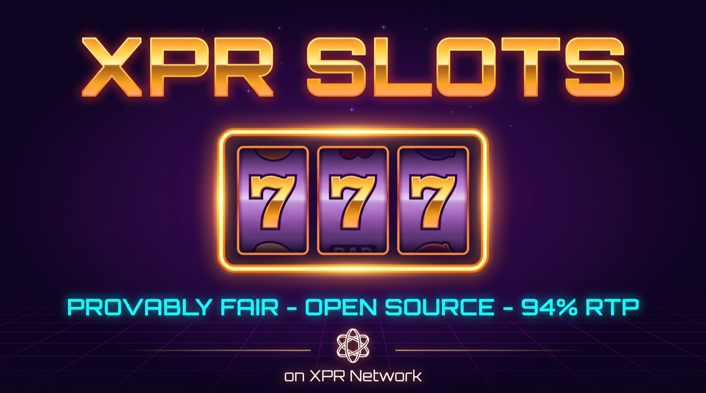

<p align="center">
  
</p>

# XPR Slots

Provably fair blockchain slot machine on XPR Network.

> Open-source **demonstration** project — **not a money-making endeavor**. Created by
> Paul Grey (`protonnz`); occasionally topped up / maintained for demonstration
> purposes, and community-sustainable: anyone can top up the jackpot or house
> balance (see [Transfer Memos](#transfer-memos)).

**Live:** https://xprslots.com
**Contract:** `xprslots` (mainnet)
**Owner:** `protonnz`
**GitHub:** https://github.com/paulgnz/xpr-slots

## Architecture

```
┌─────────────────┐     ┌─────────────────┐     ┌─────────────────┐
│    Frontend     │────▶│   xprslots      │────▶│   rng oracle    │
│   (Vite/JS)     │     │   (contract)    │◀────│   (randomness)  │
└─────────────────┘     └─────────────────┘     └─────────────────┘
```

### Flow
1. User sends XPR to `xprslots` with memo `spin`
2. Contract requests random number from RNG oracle
3. Oracle calls `receiverand` with random value
4. Contract calculates result and pays out winnings

## Payouts

Tuned for **~94% RTP** (≈6% house edge). Multipliers scale with symbol rarity,
and a matching pair returns your stake (push):

| Combination | Payout |
|-------------|--------|
| 7️⃣ 7️⃣ 7️⃣ | Jackpot (entire pool) |
| 📊 📊 📊 | 24x bet |
| 🔔 🔔 🔔 | 12x bet |
| 🍒 🍒 🍒 | 5x bet |
| 🍋 🍋 🍋 | 3x bet |
| Any 2 match | 1x bet (money back) |

### Symbol Mapping
| Index | Symbol |
|-------|--------|
| 0 | 🍋 Lemon |
| 1 | 🍒 Cherry |
| 2 | 🔔 Bell |
| 3 | 📊 Bar |
| 4 | 7️⃣ Seven |

### Bet Limits
- **Minimum:** 1 XPR
- **Maximum:** 1,000 XPR
- **Max Payout Cap:** 1,000,000 XPR

## Bet Distribution

Every spin distributes the bet as follows:
- **5%** → House balance (profit accounting)
- **6%** → Jackpot pool
- **89%** → Available for payouts

## Jackpot

**To win:** Get 7️⃣7️⃣7️⃣ (three Sevens)

**Probability:**
- Seven has 10/125 (8%) chance per reel
- Three Sevens = (10/125)³ = **0.051%** or ~**1 in 1,953 spins**

**Payout:**
- Winner receives the entire `jackpotPool` (no house subsidy — fully funded by play)
- Capped at MAX_PAYOUT (1,000,000 XPR) and available contract balance

**Pool growth:**
- 6% of every bet automatically goes to jackpot pool
- Owner can seed/top up via transfer with memo `jackpot`

## Transfer Memos

| Memo | Action |
|------|--------|
| `spin` | Play the slot machine |
| `deposit` | Add to house balance |
| `jackpot` | Add directly to jackpot pool |

---

## IMPORTANT: Accounting Notes

### Internal vs Actual Balance

The contract tracks two internal balances in the `config` table:
- `jackpotPool` - XPR reserved for jackpot
- `houseBalance` - House profits

**These are just numbers in a table, NOT actual token balances.**

The actual XPR is held in the `xprslots` eosio.token balance. These must stay in sync.

### Checking Balance Integrity

```bash
# Internal accounting
proton table xprslots config

# Actual XPR balance
proton account xprslots -t | grep XPR
```

**Rule:** `actual balance` must be >= `jackpotPool` (at minimum)

**Note:** Anything that spends XPR from the contract account externally (e.g.
buying RAM) lowers the actual token balance without updating internal
accounting. Deposit an equivalent amount with memo `deposit` afterward to keep
the two in sync.

---

## Admin Actions

All require `xprslots@owner` or `protonnz@active` authorization:

| Action | Description |
|--------|-------------|
| `pause` | Emergency stop - blocks new spins |
| `unpause` | Resume operations |
| `withdraw(to, amount)` | Withdraw from house balance only |
| `setowner(newowner)` | Transfer ownership |
| `cleanup(maxGames)` | Clear old pending games (>1hr) |
| `refund(gameId)` | Refund a specific stuck game |

## Security Features

- Oracle-based RNG (can't manipulate randomness)
- Owner-only admin functions with `requireAuth`
- MAX_PAYOUT cap (1,000,000 XPR)
- Jackpot pays only the funded pool, capped at actual balance (never insolvent)
- Pending spin tracking (prevents replay attacks)
- Balance checks before payouts
- Contract can only spend via defined actions

---

## Project Structure

```
xpr-slots/
├── contract/
│   └── assembly/
│       ├── index.ts          # Smart contract source
│       └── target/           # Compiled WASM + ABI
├── frontend/
│   ├── index.html            # UI + all CSS
│   ├── public/
│   │   └── og-image.png      # Social sharing image
│   └── src/
│       └── main.js           # Frontend logic
├── README.md
└── .gitignore
```

## Development

### Build Contract
```bash
cd contract
npm install
npm run build
```

### Deploy Contract
```bash
proton contract:set xprslots ./contract/assembly/target -p xprslots@owner
```

### Run Frontend Locally
```bash
cd frontend
npm install
npm run dev
```

---

## CLI Quick Reference

```bash
# Check account status
proton account xprslots -t

# Check contract config (jackpot, house balance, stats)
proton table xprslots config

# Check recent spin results
proton table xprslots spinresults

# Check player stats
proton table xprslots playerstats

# Check pending games (should be empty normally)
proton table xprslots games

# Buy RAM (if needed) - 2MB example
proton ram:buy xprslots xprslots 2097152 -p xprslots@owner

# Pause contract (emergency)
proton action xprslots pause '{}' xprslots@owner

# Unpause contract
proton action xprslots unpause '{}' xprslots@owner

# Withdraw house profits to protonnz
proton action xprslots withdraw '{"to":"protonnz","amount":"1000.0000 XPR"}' xprslots@owner

# Cleanup old stuck games
proton action xprslots cleanup '{"maxGames":10}' xprslots@owner
```

---

## Resources

- **Block Explorer:** https://explorer.xprnetwork.org/account/xprslots
- **RAM Portal:** https://resources.xprnetwork.org
- **XPR Network Docs:** https://docs.xprnetwork.org

## Changelog

### 2026-06-10 - Payout rebalance (~40% → ~94% RTP)
- Any-2 match 0.5x → 1x (push); lemon 1.5x → 3x; bell 2x → 12x; bar 3x → 24x; cherry stays 5x
- Multipliers now scale with symbol rarity
- Jackpot pays the funded pool only (removed the 10,000 XPR house-subsidized floor)
- Jackpot contribution 10% → 6% of each bet
- Owner topped up 25,000 XPR (10k jackpot seed + 15k bankroll)
- Frontend: paytable + Provably Fair panel updated; added live on-chain code-hash verification

### 2026-01-22 - Initial Mainnet Launch
- Deployed to `xprslots` on mainnet
- Owner set to `protonnz`
- Initial funding: 100,000 XPR
- RAM: 2.36 MB (enough for ~20k games)
- Mobile responsive UI
- Social meta tags (og:image)
- Fixed small amount display (0.5 XPR was showing as 0)
- Fixed logout button event listener
- Deposited 2,500 XPR to cover RAM purchase accounting gap
- Deposited 10,000 XPR buffer to protect jackpot reserve from regular payouts

### Known Issues / TODO
- No admin action to adjust internal balances (jackpotPool/houseBalance) - must deposit to correct any discrepancies
- Consider adding `adjustbalance` action for accounting corrections after RAM purchases
- **IMPORTANT:** `getAvailableBalance()` does not reserve jackpot pool - regular payouts can theoretically drain below jackpot. Mitigated by maintaining 10k+ XPR buffer above jackpot. Proper fix: modify function to return `totalBalance - jackpotPool`

---

## Support

XPR Slots is run as a free, open-source demo by **protonnz**, a block producer on
XPR Network. If you find it useful, consider **voting `protonnz` as a block
producer** (in your WebAuth wallet → Vote) — it helps support work like this.
[See the validator →](https://explorer.xprnetwork.org/account/protonnz)

---

## Disclaimer

This is a demonstration of blockchain-based gaming and **not a commercial or money-making venture** — the small (~6%) margin exists only to keep the contract solvent, and anyone can top up the jackpot or house balance to help sustain it. Users must be 21+ years old. Do not use in jurisdictions where online gaming is prohibited. The software is provided "AS IS" without warranty. The developers assume no responsibility for any losses.

## License

MIT
